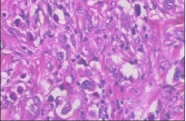
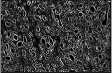
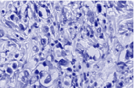
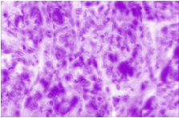

# Breast Cancer biopsy image analysis using a Convolutional Neural Network (CNN)

# Objective
Breast cancer tumor biopsy classification of benign or malignant remains a very manual and subjective process, done by specially trained pathologists.  Breast Cancer is the 2nd leading cause of cancer deaths globally, in women.  Advancing the fight against cancer requires early detection which could be aided by an efficient detection system. 

The goal of this project is to train and tune a convoluted artificial network (CNN) to accurately classify breast cancer biopsies as malignant or benign.  Some recent [studies](https://arxiv.org/abs/1811.12231) suggest CNNs may be biased do better than textures than shapes, implying Deep neural networks are particularly suited to pattern recognition, perhaps gaining better results without first identifying the same features a human would look for.  

# Data Source
I have utilized the [BreakHis](https://web.inf.ufpr.br/vri/databases/breast-cancer-histopathological-database-breakhis/) database, which has been accumulated from the result of a survey by P&D Lab, Brazil in 2014. Breast tissues are taken as samples by the procedure of surgical (open) biopsy (SOB). Samples are stained by hematoxylin and eosin (HE) and produced by a standard paraffin process in which specimen infiltration and embedment are done in paraffin. These histopathology images have a RGB (three channel) TrueColor (8 bits- Red, 8 bits- Green, 8 bits- Blue) color coding scheme. This database contains a total of 7909 images of 700x460 pixel resolution. Images are captured in four different magnification levels, 40X, 100X, 200X, and 400X.  As prior studies have acheived about 5% higher prediction results with the higher magnifications, highest with 200x, I'll focus on that particular dataset.    

The data is classified as Benign or Malignant, and represents 4 different types of tumor in each classification.  

Benign
 Malignant 

# EDA 

## Feature Identification / Image Pre-processing
In the visual context, malignant tumors tend to have large and irregular nuclei or multiple nuclear structures. The cytoplasm also undergoes changes, wherein new structures appear, or normal structures disappear. Malignant cells have a small cytoplasmic amount (either intensely colored or on the contrary, very pale), frequently with vacuoles. In this scenario, the ratio of cytoplasm to nucleus decreases. We can use image pre-processing to help "bring forward" the features that may help identify malignant vs benign tumors, to amplify nuclei and cytoplasm and ignore unintersting features like fatty regions.

*Interesing pre-processing transformations*

Analyzed the following types of image pre-processing, we're looking for patterns we might be able to highlight to make it easier for the model to recongize:

* Best Greyscale filters: Chambolle Denoise, Sobel on a Malignant Carcinoma

  

* Best Color filter: Immunohistochemical staining colors separation: Hematoxylin and Eosin (H&E) Dye separation.  Hematoxylin for nuclei in blue vs Eosin which stains the extracellular matrix and cytoplasm pink, recombine and rescale.  It appears color does help distinguish benign from malignant.

 

These can be used as input in place of the full color images to see if any improvement in learning can be gained. 

In the case of supervised learning, we do not need to provide these features explicitly. In this case images are fed to the CNN, along with each class as a label (Benign (B) or Malignant (M)). From the automatic update of filter values in the training process, CNN should be able to extract the computational features. 

# Training / Testing

* 80/20 Train/Test split and 3-fold cross validation to ensure.

Data Augmentation (slight rotation, flip, zoom to produce new samples) Helps Solve:
- Need for more data to train
- Re-balance Benign and Malignant training samples (close to 50/50)

# Model Selection

### Choice of Hypterparameters
* number of filters
* dimensions of convolution layer
* dimensions of pooling layer (reduces dimensions, reduces variance)

Credit Dabeer et al.

Loss function - Sparse_categorical_crossentropy. 
Optimizer - Adadelta did better at showing a steady decrease in loss rate
Metrics - Accuracy 

**Table 1. Parameters of the Convolutional Layer Parameters**
| Layer         | L1   | L2   | L3   | L4   | L5   | 
| ------------- |:----:|:----:|:----:|:----:|:----:|
| Type	        | conv | conv | pool | conv | pool |
| Channel	    | 32   | 64	  |  -   | 128	|  –   |
| Filter Size	| 5 × 5| 5 × 5|	–	 |5 × 5	| –    |
| Conv. stride	| 1 × 1| 1 × 1|	–	 |1 × 1	| –    |
| Pooling size	|   -  |  -   | 3 × 3|	–	| 3 × 3|
| Pooling stride|	–  | -    | 1 × 1|	–	| 1 × 1|	
| Padding size  | same |	  |valid |  –	|valid |		
| Activation    | ReLu | ReLu | –	| ReLu | –     |

**Table 2. Details of Fully Connected network**
| Layer Attribute | FC-1   | FC-2   | FC-3   | 
| --------------- |:------:|:------:|:------:|
| No of nodes     |	64	   | 64     |	2   |
| Activation used | Sigmoid | Sigmoid |	Softmax |

Cost Measures:

Precision and F-score are ill-defined and being set to 0.0 in labels with no predicted samples. 

              precision    recall  f1-score   support

           0       0.49      1.00      0.66       259
           1       0.00      0.00      0.00       269

    accuracy                           0.49       528
   macro avg       0.25      0.50      0.33       528
weighted avg       0.24      0.49      0.32       528

Test scores: [0.705602582656976, 0.4905303]
Test accuracy: 0.4905303

# Conclusions:
The model is not training properly, indicating insufficient training data, underfit and/or incomplete tuning.
- Increase Network size, adding more layers and epochs, leveraging additional computing power on AWS
- Tuning
- Overfit, then add regularization 

### Cited

"Cancer Diagnosis in histopathological image: CNN based approach" (Dabeer, S., Khan, M.M., Islam, S.) 2019
 https://doi.org/10.1016/j.imu.2019.100231.

"Imagenet-trained CNNs are biased towards texture; increasing shape bias improves accuracy and robustness" (R. Geirhos, P. Rubisch, C. Michaelis, M. Bethge, F.A. Wichmann, W. Brendel)
International conference on learning representations (2019)
https://openreview.net/forum?id=Bygh9j09KX
